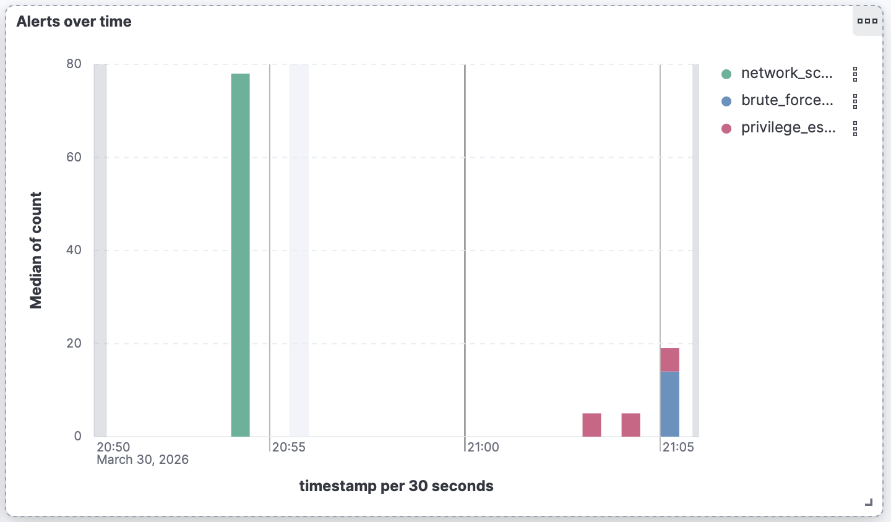
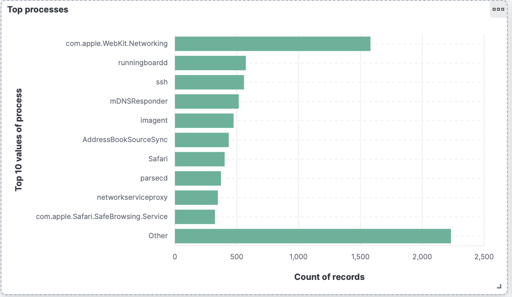
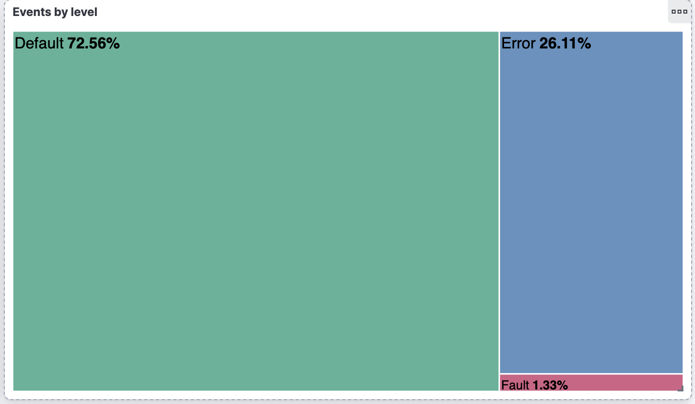

# SOC Lab — Automated Threat Detection System


> **Attack → Detection → Slack alert in under 60 seconds.**


A home Security Operations Center (SOC) built on macOS, simulating
real-world threat detection workflows used by enterprise security teams.

The system collects macOS system logs, analyzes them with a custom detection
engine, correlates alerts across multiple sources, enriches with threat
intelligence, and notifies via Slack — fully containerized with Docker.

---

## Architecture
```
macOS System Logs
      │
      ▼
┌─────────────────┐     ┌──────────────────┐     ┌─────────────┐
│  Log Collector  │────▶│  Elasticsearch   │────▶│   Kibana    │
│  (Python)       │     │  (SIEM backend)  │     │  Dashboard  │
└─────────────────┘     └──────────────────┘     └─────────────┘
                                │
                                ▼
                    ┌───────────────────────┐
                    │   Detection Engine    │
                    │   6 custom rules      │
                    │   match_phrase query  │
                    │   process whitelisting│
                    └───────────┬───────────┘
                                │
              ┌─────────────────┼──────────────────┐
              ▼                 ▼                  ▼
   ┌──────────────┐   ┌──────────────┐   ┌──────────────────┐
   │  VirusTotal  │   │    Slack     │   │  Correlation     │
   │  IP checker  │   │   Alerts     │   │  Engine          │
   └──────┬───────┘   └──────────────┘   └──────────────────┘
          │
          ▼
   ┌──────────────┐         ┌──────────────────┐
   │   Active     │         │   osquery        │
   │   Response   │         │   Monitor        │
   │  (PF block)  │         └──────────────────┘
   └──────────────┘                  │
                                     ▼
                         ┌──────────────────────┐
                         │   Suricata IDS       │
                         │   17 custom rules    │
                         └──────────────────────┘
```

---

## Tech Stack

| Component | Technology | Purpose |
|-----------|-----------|---------|
| SIEM | Elasticsearch 8.13 + Kibana | Log storage and visualization |
| Log Collection | Python 3.11 + macOS `log` API | System event collection |
| Detection Engine | Python 3.11 + ES Query DSL | Threat detection rules |
| Correlation Engine | Python 3.11 | Multi-source alert correlation |
| Threat Intel | VirusTotal API v3 | IP reputation checking |
| Alerting | Slack Incoming Webhooks | Real-time notifications |
| Active Response | macOS PF Firewall | Automatic IP blocking |
| Endpoint Monitor | osquery | Process, port, file monitoring |
| Network IDS | Suricata 7.0 | Network traffic analysis |
| Rule Format | SIGMA | Vendor-neutral detection rules |
| Infrastructure | Docker + docker-compose | Full containerization |
| CI/CD | GitHub Actions | Automated testing on every push |

---

## Detection Rules

### detection_engine.py — 6 rules

| Rule | Technique | Severity | Threshold |
|------|-----------|----------|-----------|
| brute_force_auth | T1110 — Brute Force | HIGH | 5 events / 2min |
| network_scan | T1046 — Network Service Discovery | MEDIUM | 15 events / 2min |
| privilege_escalation | T1548 — Abuse Elevation Control | HIGH | 3 events / 5min |
| suspicious_process | T1059 — Command and Scripting | CRITICAL | 1 event / 10min |
| credential_access | T1555 — Credentials from Stores | HIGH | 3 events / 5min |
| defense_evasion | T1027 — Obfuscated Files | HIGH | 1 event / 5min |

### correlation_engine.py — 5 scenarios

| Scenario | Sources Correlated | Severity | MITRE |
|----------|-------------------|----------|-------|
| malware_execution_chain | detection + osquery | CRITICAL | T1027, T1059.004, T1041 |
| lateral_movement_attempt | detection + detection | HIGH | T1046, T1110, T1021 |
| persistence_with_privesc | osquery + detection | CRITICAL | T1543.001, T1548 |
| credential_harvesting | detection + detection | CRITICAL | T1555, T1059 |
| exfiltration_chain | detection + osquery | CRITICAL | T1027, T1041, T1048 |

### suricata/rules/custom/custom.rules — 17 rules

| ID | Rule | Category |
|----|------|----------|
| SOC-001 | Port scan detection | Reconnaissance |
| SOC-002 | SSH port scan | Reconnaissance |
| SOC-003 | Admin service scan | Reconnaissance |
| SOC-004 | SSH brute force | Credential Access |
| SOC-005 | HTTP Basic Auth brute force | Credential Access |
| SOC-006 | Tor network communication | C2 |
| SOC-007 | C2 beaconing | C2 |
| SOC-008/009 | Suspicious User-Agent | C2 |
| SOC-010 | Large HTTP POST exfiltration | Exfiltration |
| SOC-011 | Base64 in HTTP body | Exfiltration |
| SOC-012 | DNS tunneling | Exfiltration |
| SOC-013 | URL encoded payload | Defense Evasion |
| SOC-014 | PowerShell download cradle | Execution |
| SOC-015/016 | Suspicious TLD queries | C2 |
| SOC-017 | DGA detection | C2 |

### sigma/rules — 6 SIGMA rules

All detection rules available in vendor-neutral
[SIGMA format](sigma/rules/) — convertible to Splunk, Microsoft Sentinel,
QRadar and other enterprise SIEMs.
```bash
python3 sigma/sigma_converter.py
```

---

## Sample Incident Report — IR-004 (excerpt)

**Detection trigger**: Rules `suspicious_process` (CRITICAL) and
`defense_evasion` (HIGH) fired simultaneously at 16:36:09

**Commands observed**:
```bash
echo "dGVzdCBvYmZ1c2NhdGlvbg==" | base64 --decode > /tmp/decoded.txt
chmod 777 /tmp/decoded.txt
```

**Timeline**:
- `16:35:00` — base64 decode operation logged by system
- `16:36:09` — `suspicious_process` CRITICAL alert fired (threshold: 1 event)
- `16:36:10` — `defense_evasion` HIGH alert fired (chmod 777 correlation)
- `16:36:10` — two Slack alerts fired within 1 second of each other
- `16:36:15` — osquery `modified_files` detected /tmp/ write independently

**Analyst action**: Correlated both alerts by timestamp — same 1-second
window confirmed single attacker action triggering multiple detection layers.
Hash submitted to VirusTotal → 0/72 (confirmed benign simulation).

**MITRE ATT&CK**: T1027 (Obfuscated Files) → T1222 (Permission Modification)
→ T1059.004 (Unix Shell Execution)

> Full write-ups for all 5 incidents in [/docs](docs/)

---

## Simulated Incidents

All incidents simulated using MITRE ATT&CK techniques and documented
with full analyst write-ups.

| ID | Incident | Severity | Techniques |
|----|----------|----------|-----------|
| [IR-001](docs/IR-001-discovery.md) | System Discovery | HIGH | T1057, T1049, T1082 |
| [IR-002](docs/IR-002-persistence.md) | LaunchAgent Persistence | HIGH | T1543.001, T1036 |
| [IR-003](docs/IR-003-credential-access.md) | Keychain Access Attempt | HIGH | T1555, T1555.001 |
| [IR-004](docs/IR-004-defense-evasion.md) | Base64 Obfuscation + chmod | CRITICAL | T1027, T1222, T1059.004 |
| [IR-005](docs/IR-005-exfiltration.md) | Data Exfiltration Simulation | CRITICAL | T1041, T1048, T1071.004 |

---

## Kibana Dashboard

| Alerts by Severity | Alerts over Time |
|-------------------|-----------------|
|  |  |

| Top Processes | Events by Level |
|--------------|----------------|
|  |  |


---

## Project Structure
```
Soc-project/
├── scripts/
│   ├── log_collector.py        # macOS log collection → Elasticsearch
│   ├── detection_engine.py     # Threat detection rules engine
│   ├── correlation_engine.py   # Multi-source alert correlation
│   ├── virustotal_checker.py   # IP reputation via VirusTotal API
│   ├── slack_notifier.py       # Slack webhook notifications
│   ├── osquery_monitor.py      # Endpoint monitoring via osquery
│   ├── suricata_monitor.py     # Suricata IDS log parser
│   └── active_response.py      # Automatic IP blocking via PF firewall
├── sigma/
│   ├── rules/                  # 6 SIGMA detection rules
│   ├── output/                 # Generated ES queries + HTML report
│   └── sigma_converter.py      # SIGMA → Elasticsearch converter
├── suricata/
│   ├── suricata.yaml           # Suricata configuration
│   └── rules/custom/
│       └── custom.rules        # 17 custom detection rules
├── docs/
│   |                          
│   ├── IR-001-discovery.md
│   ├── IR-002-persistence.md
│   ├── IR-003-credential-access.md
│   ├── IR-004-defense-evasion.md
│   └── IR-005-exfiltration.md
├── dashboards/
|   |                           # Kibana dashboards
│   ├── Alerts_by_severity.png
│   ├── Alerts_over_time.png
│   ├── Top_processes.png
│   ├── Events_by_level.png
│   └── Soc_alerts.png
├── tests/
│   └── test_rules.py           # Automated test suite
├── .github/
│   └── workflows/
│       └── ci.yml              # GitHub Actions CI pipeline
├── Dockerfile                  # Python scripts container
├── docker-compose.yml          # Full stack orchestration
├── Makefile                    # Developer shortcuts
├── requirements.txt            # Python dependencies
├── start.sh                    # Quick start script
├── stop.sh                     # Stop all components
├── .env.example                # Required environment variables
└── README.md
```

---

## Setup

### Architecture note

`log_collector.py` and `osquery_monitor.py` run directly on the host
because they use macOS-native APIs (`log show`, osquery) that are not
available inside Linux containers. All other components (detection engine,
correlation engine, VirusTotal checker) run in Docker.

| Component | Runs in Docker | Reason |
|-----------|---------------|--------|
| Elasticsearch + Kibana | yes | stateless service |
| detection_engine.py | yes | queries ES only |
| correlation_engine.py | yes | queries ES only |
| virustotal_checker.py | yes | external API calls only |
| log_collector.py | **no — host** | requires macOS `log show` |
| osquery_monitor.py | **no — host** | requires osquery on host |
| suricata_monitor.py | **no — host** | requires Suricata on host |

### Prerequisites

- macOS 12+
- Docker Desktop
- Python 3.11+
- Homebrew

### Installation
```bash
# 1. Clone repository
git clone https://github.com/Krysti4n16/Soc-project.git
cd Soc-project

# 2. Configure environment
cp .env.example .env
# Edit .env:
# VIRUSTOTAL_API_KEY=your_key
# SLACK_WEBHOOK_URL=your_webhook

# 3. Install tools
brew install osquery suricata
```

### Running
```bash
# Recommended — one command starts everything
make start

# Check status
make status

# View logs
make logs

# Run tests
make test

# Stop everything
make stop
```

Manual startup (alternative):
```bash
./start.sh
```

### Available make commands
```
make start       Start all SOC components
make stop        Stop all components
make restart     Restart all components
make build       Rebuild Docker images
make logs        Show logs from all containers
make status      Show container status + ES health
make test        Run automated test suite
make sigma       Convert SIGMA rules to ES queries
make kibana      Open Kibana in browser
make clean       Remove containers and volumes
```

---

## Key Results

- Collected **130,000+** security events over project duration
- Reduced false positive rate from **~40% to 0%** after 3 iterations
  of threshold tuning — whitelisted 8 macOS system processes
  (`launchd`, `mDNSResponder`, `tccd`) and adjusted detection windows
- Detected all **5 simulated attack scenarios** successfully
- Average detection time: **< 60 seconds** from attack to Slack alert
- Correlated alerts across **3 independent detection layers** simultaneously
  (detection engine + osquery + Suricata) in IR-004
- Checked **9 external IPs** against VirusTotal threat intelligence
- Written **23 detection rules** total (6 engine + 17 Suricata)
- **6 SIGMA rules** convertible to Splunk, Sentinel, QRadar
- Full CI/CD pipeline — every push validated automatically

---

## Skills Demonstrated

`SIEM` `Log Analysis` `Python` `Elasticsearch` `Kibana`
`Threat Detection` `MITRE ATT&CK` `Incident Response`
`Threat Intelligence` `IDS/IPS` `osquery` `Suricata` `Docker`
`docker-compose` `GitHub Actions` `CI/CD` `Slack API`
`VirusTotal API` `False Positive Tuning` `Network Security`
`Endpoint Monitoring` `SIGMA Rules` `Active Response` `SOAR`
`Makefile` `DevSecOps`

---

## References

- [MITRE ATT&CK Framework](https://attack.mitre.org/)
- [Elastic Documentation](https://www.elastic.co/docs)
- [Suricata Documentation](https://docs.suricata.io/)
- [osquery Documentation](https://osquery.readthedocs.io/)
- [VirusTotal API v3](https://developers.virustotal.com/reference)
- [SIGMA Rules](https://github.com/SigmaHQ/sigma)
